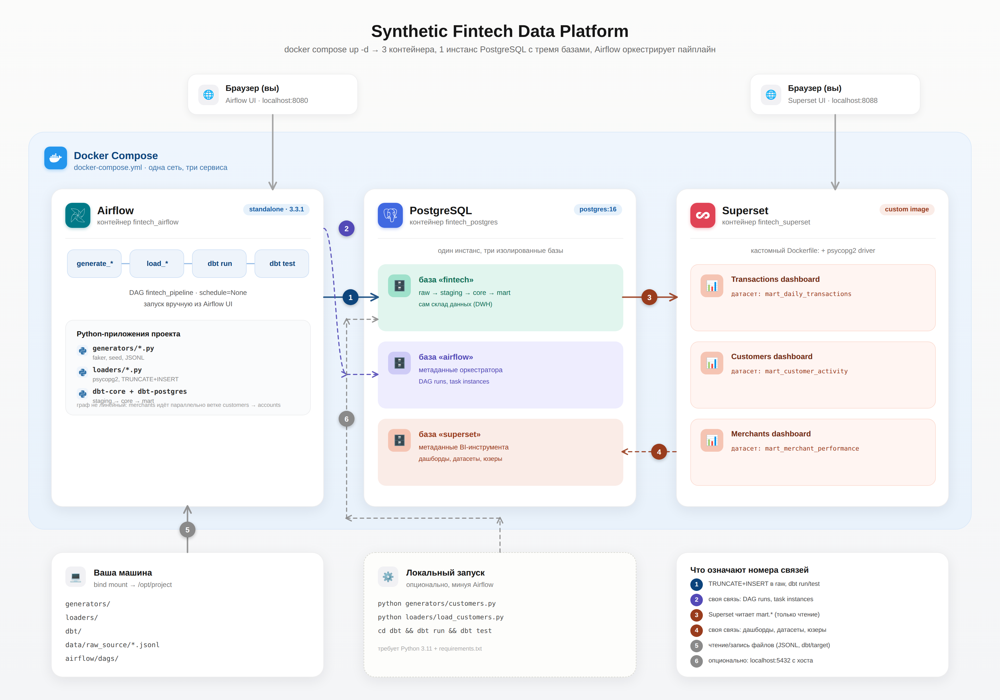
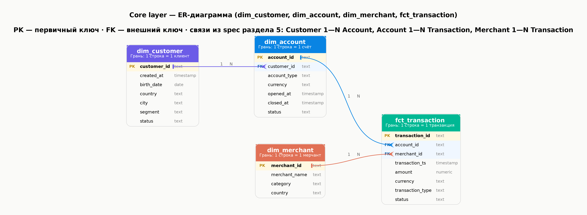

# Synthetic Fintech Platform

Локальная data-платформа для обработки синтетических финтех-данных.

## Архитектура

```text
Python-генераторы
       ↓
     JSONL
       ↓
 PostgreSQL RAW
       ↓
     dbt
       ↓
   STAGING
       ↓
     CORE
       ↓
     MART
       ↓
   Superset

Пайплайн оркестрируется Airflow.
```



## Модель данных

- Customer
- Account
- Merchant
- Transaction



## Структура проекта

```text
generators/     # генерация исходных данных
loaders/        # загрузка данных в PostgreSQL
data/           # raw JSONL
postgres/       # инициализация PostgreSQL
dbt/            # трансформации и витрины
airflow/        # DAG-и
superset/       # конфигурация Superset
tests/          # тесты
```

## Требования

- Windows + WSL2 / macOS / Linux
- Docker Desktop (Windows/macOS) или Docker Engine + Compose (Linux)
- Git

## Запуск

Клонировать репозиторий:

```bash
git clone https://github.com/phineaeas/synthetic-fintech-platform.git
cd synthetic-fintech-platform
```

Настроить окружение (создаст `.env`, поправит права на `data/` и `dbt/`):

```bash
bash scripts/setup.sh
```

Поднять сервисы:

```bash
docker compose up -d
```

Проверить контейнеры:

```bash
docker compose ps
```

## Доступ к сервисам

**Airflow** — http://localhost:8080
Логин `admin`, пароль генерируется при первом запуске:

```bash
docker compose logs airflow 2>&1 | grep -i "password for user"
```

Разморозьте DAG `fintech_pipeline` и запустите вручную.

**Superset** — http://localhost:8088
Логин: `admin` / `admin`

## Пайплайн

```text
generate
   ↓
load_raw
   ↓
dbt run
   ↓
dbt test
```

Пайплайн запускается и оркестрируется через Airflow.

## Сервисы

| Сервис | Назначение |
|---|---|
| PostgreSQL | хранение данных |
| Airflow | оркестрация |
| dbt | трансформации |
| Superset | визуализация |

## Остановка

```bash
docker compose down
```
